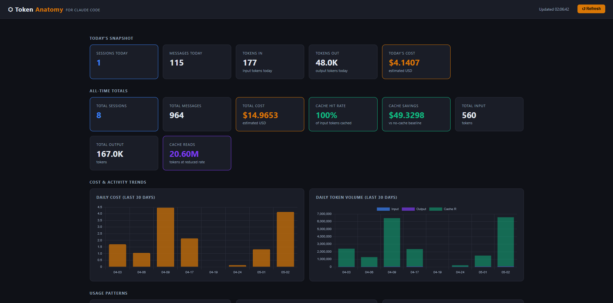

# ⬡ Token Anatomy

> Local analytics dashboard for Claude Code — pure Python, zero dependencies, zero installs.

Token Anatomy reads your Claude Code session files and shows you exactly where your tokens and money are going.



---

## Quick Start

No install needed. Run directly:

```bash
git clone https://github.com/Muhit1204/token-anatomy.git
cd token-anatomy
python run.py
```

Then open [http://localhost:3456](http://localhost:3456). Dashboard opens automatically.

**Requirements:** Python 3.8+ · Claude Code CLI · That's it.

---

## What You Get

| Panel | What it shows |
|---|---|
| **Today's Snapshot** | Sessions, messages, tokens in/out, cost today |
| **All-Time Totals** | Total cost, cache hit rate, savings, lifetime token usage |
| **Cost & Activity Trends** | Daily cost + token volume (last 30 days) |
| **Usage Patterns** | Hourly heatmap, model usage, cache performance |
| **Retrospective** | Topic clusters (where your work concentrates) + behavioral working styles |
| **Tool Call Frequency** | Which tools Claude reaches for most |
| **Insights & Advisor** | 7 plain-English diagnoses — what you're doing and how to improve |
| **Per-Project Breakdown** | Which projects cost the most |
| **Daily Breakdown** | Per-day token and cost history (last 60 days) |
| **Chat Cost Browser** | Search, filter, sort every session — find your most expensive chats |
| **Hover Tooltips** | Hover any number to see what it means in plain English |

Auto-refreshes every 60 seconds. No page reload needed.

### Navigation

Sticky header with jump-nav pills — click any section name to jump directly to it. Active section highlights as you scroll. Back-to-top button appears at the bottom of the page.

---

## How It Works

Claude Code saves a log file for every session here:

```
~/.claude/projects/<project>/
    <session-id>.jsonl
```

Token Anatomy reads those files, calculates costs, and serves a dashboard at `localhost:3456`. Everything stays on your machine — no data leaves your computer.

---

## Windows Users

```powershell
git clone https://github.com/Muhit1204/token-anatomy.git
cd token-anatomy
python run.py
```

---

## Custom Token Rates

Defaults match the Anthropic API (Claude Sonnet pricing). Override with environment variables:

**macOS / Linux**
```bash
RATE_INPUT=3.0 RATE_OUTPUT=15.0 python run.py
```

**Windows (PowerShell)**
```powershell
$env:RATE_INPUT="3.0"; $env:RATE_OUTPUT="15.0"; python run.py
```

**AWS Bedrock (ap-southeast-2)**
```bash
RATE_INPUT=5.0 RATE_OUTPUT=25.0 RATE_CACHE_READ=0.5 RATE_CACHE_WRITE=6.25 python run.py
```

### All variables

| Variable | Default | Description |
|---|---|---|
| `CLAUDE_DIR` | `~/.claude` | Path to your Claude data folder |
| `PORT` | `3456` | Port to run the dashboard on |
| `RATE_INPUT` | `3.0` | Input token price (USD per 1M tokens) |
| `RATE_OUTPUT` | `15.0` | Output token price (USD per 1M tokens) |
| `RATE_CACHE_READ` | `0.30` | Cache read price (USD per 1M tokens) |
| `RATE_CACHE_WRITE` | `3.75` | Cache write price (USD per 1M tokens) |

---

## License

MIT — see [LICENSE](LICENSE)
